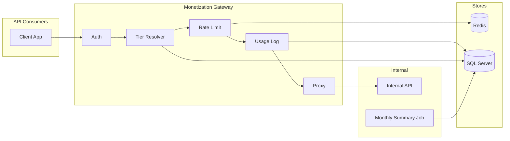
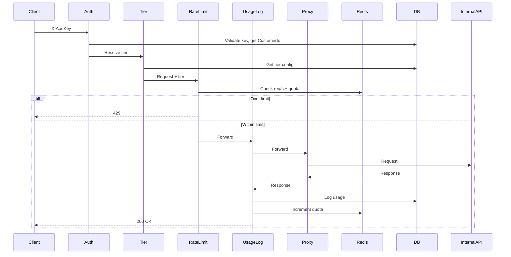
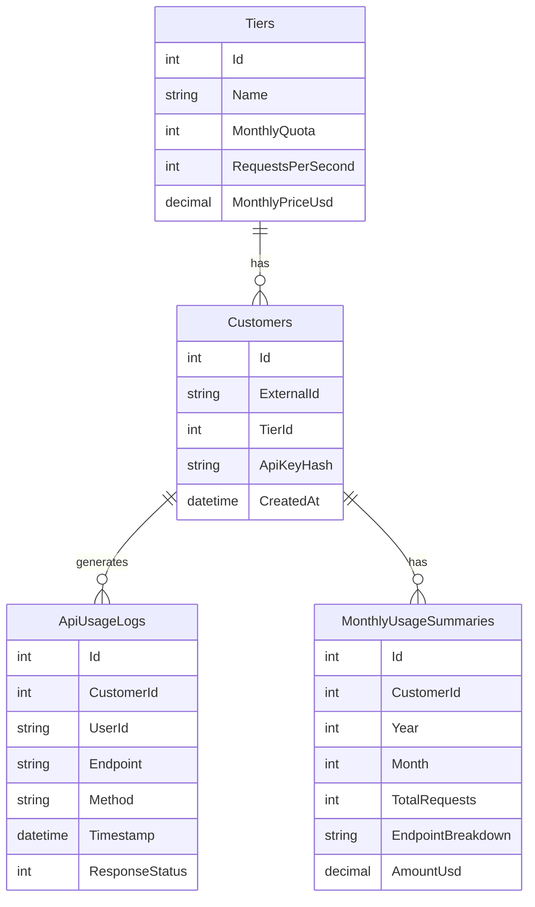

# API Monetization Gateway

A .NET API gateway that sits between external API consumers and internal services. It authenticates via API key, enforces **per-customer** rate limits (requests per second and monthly quota) using Redis, logs usage to SQL Server, and runs a background job that summarizes monthly usage for billing. Tier configuration is stored in SQL Server and is dynamic (no deploy to change limits).

---

## Challenge Summary

| Tier | Monthly Quota | Rate Limit | Pricing |
|------|---------------|------------|---------|
| Free | 100 requests/month | 2 requests/second | $0 |
| Pro  | 100,000 requests/month | 10 requests/second | $50/month |

**Delivered:**

- Solution design with system architecture and ERD
- Rate limiting and tier enforcement with HTTP 429 handling and configurable tiers
- API usage tracking with metadata and a monthly summarization job
- Unit and integration tests
- Docker image and run instructions below

---

## Solution Design

### System architecture



- **Request path:** Auth (X-Api-Key → customer) → Tier resolution (DB/cache) → Rate limit (Redis: req/s + monthly quota) → Usage logging → Proxy to internal API.
- **Redis:** Sliding-window req/s and monthly quota counters. Keys: `ratelimit:{customerId}:second`, `quota:{customerId}:{year}:{month}`. Limits are **per customer globally** (not per endpoint).
- **SQL Server:** Tiers, Customers, ApiUsageLogs (per successful call), MonthlyUsageSummaries (filled by background job for reporting/billing; real-time quota is Redis only).

### Request flow (sequence)



1. **Auth** validates API key (SHA256 vs DB), sets CustomerId; invalid → 401.
2. **Tier** resolves tier (DB/cache); not found → 403.
3. **Rate limit** checks Redis; exceeded → **429** with Retry-After and rate-limit headers/body.
4. Request forwarded to internal API; on **2xx**, **Usage logging** writes ApiUsageLog and increments quota in Redis (fire-and-forget).

### Entity-relationship diagram



- **Tiers:** Dynamic limits and pricing (Free/Pro seeded). Id is primary key.
- **Customers:** ApiKeyHash = SHA256(API key) only; one tier per customer. Id PK, TierId FK to Tiers.
- **ApiUsageLogs:** One row per successful call (CustomerId FK, optional UserId, endpoint, method, timestamp, status).
- **MonthlyUsageSummaries:** One row per customer per month; written by background job (TotalRequests, EndpointBreakdown JSON, AmountUsd from tier). CustomerId FK.

---

## Tech Stack and Approach

| Layer | Choice | Why |
|-------|--------|-----|
| Runtime | .NET 10, ASP.NET Core | Modern LTS; Minimal APIs fit a thin gateway. |
| API style | Minimal APIs | Health, stub, proxy only; no MVC overhead. |
| Rate limit store | Redis (StackExchange.Redis) | Fast counters and TTL; sliding window + monthly quota. |
| Persistence | SQL Server + EF Core | Tiers, usage logs, monthly summaries; migrations for schema. |
| Background job | IHostedService + BackgroundService | One periodic job; no extra scheduler. |
| Config | Options pattern (IOptions&lt;T&gt;) | Strongly-typed, testable, bound from appsettings. |
| Tests | xUnit, Moq, FluentAssertions, WebApplicationFactory | Unit tests with mocked Redis; integration tests over real pipeline. |
| Containers | Docker + Docker Compose | Single command to run gateway + Redis + SQL Server. |

**Why not over-engineer:**

- No repository layer (EF used directly)
- No extra facades (IRateLimitService, ITierResolver, IUsageTrackingService only)
- No OAuth/JWT (API key suffices per scope)
- Billing = persisting MonthlyUsageSummaries (no payment provider)

Focus is on gateway behaviour: auth, limits, logging, and summarization.

---

## Rate Limiting and Tier Enforcement

- **Per-customer globally:** All requests for a customer count toward the same req/s and monthly quota regardless of path.
- **Req/s:** Sliding window in Redis (configurable window in seconds via `RateLimiting:SlidingWindowSeconds`).
- **Monthly quota:** Counter in Redis with monthly TTL; incremented only after a successful (2xx) response.
- **429 response:** JSON body (`error`, `limit`, `remaining`, `resetAt`, `retryAfter`) and headers `Retry-After`, `X-RateLimit-Limit`, `X-RateLimit-Remaining`, `X-RateLimit-Reset` (Unix seconds).
- **Tiers:** Stored in DB (Tiers table); resolved per request with short in-memory cache (TTL configurable). Change limits by updating the DB.

---

## API Usage Tracking

- **Logged fields:** CustomerId, UserId (optional, from X-User-Id), Endpoint, Method, Timestamp, ResponseStatus. One row per successful API call in **ApiUsageLogs**.
- **Logging:** After successful response, middleware logs to DB and increments monthly quota in Redis (fire-and-forget with error logging).
- **Monthly job:** BackgroundService runs on an interval (e.g. every 24h). Aggregates ApiUsageLogs by customer/month, computes TotalRequests and EndpointBreakdown (JSON), sets AmountUsd from tier; upserts **MonthlyUsageSummaries**. Idempotent for the same month.

---

## Testing

**Unit tests** (`MonetizationGateway.UnitTests`): Rate limit logic (under limit, at req/s limit, quota exceeded, Pro vs Free tier, increment quota, `EnableQuotaChecking` off) and centralized **ApiResponse** (401/403/429/500/503 status and JSON/headers). Use mocked Redis and `IOptions`; no real Redis or DB required.

**Integration tests** (`MonetizationGateway.IntegrationTests`): WebApplicationFactory; scenarios: health 200, 401 without/invalid key (with body `code`), 200 with usage log, 429 with body and rate-limit headers. Require LocalDB (and Redis if testing rate limit); see test project for configuration.

```bash
dotnet test
```

Run only unit tests (no Redis/SQL needed):

```bash
dotnet test tests/MonetizationGateway.UnitTests
```

---

## Docker Image and Instructions

**Prerequisites:** .NET 10 SDK for local build; Docker (recent stable) and Docker Compose for containerized run.

**Build and run with Docker Compose** (gateway + Redis + SQL Server):

From the repository root:

```bash
docker compose up --build
```

- **Gateway:** http://localhost:8080  
- **Health:** `GET http://localhost:8080/health` (no auth)  
- **Stub:** `GET http://localhost:8080/internal/stub` with header `X-Api-Key: <your-key>`

Environment variables (in `docker-compose.yml`): `ConnectionStrings__DefaultConnection`, `Redis__Configuration`, `InternalApi__BaseUrl`. Migrations: run on first app start or manually (e.g. `dotnet ef database update` in container or after attaching to DB).

**Dockerfile** (`docker/Dockerfile`): Multi-stage build (SDK 10 for build, aspnet 10 for runtime); exposes 8080; entrypoint runs the published app.

---

## Run Locally (without full Docker stack)

1. Start Redis and SQL Server (e.g. via Docker):

   ```bash
   docker run -d -p 6379:6379 redis:7-alpine
   docker run -d -p 1433:1433 -e ACCEPT_EULA=Y -e MSSQL_SA_PASSWORD=YourStrong@Passw0rd mcr.microsoft.com/mssql/server:2022-latest
   ```

2. Set in `appsettings.json`: `ConnectionStrings:DefaultConnection`, `Redis:Configuration` (e.g. `localhost:6379`), `InternalApi:BaseUrl`.

3. Apply migrations and run:

   ```bash
   cd src/MonetizationGateway
   dotnet ef database update
   dotnet run
   ```

To call authenticated endpoints, add a **Customer** with `ApiKeyHash` = SHA256 (lowercase hex) of your API key and the desired `TierId`. Tiers are seeded (Free, Pro).

---

## API Documentation

| Endpoint | Auth | Description |
|----------|------|-------------|
| `GET /health` | No | Health check |
| `GET /internal/stub` | Yes | Stub returns 200 |
| `* /{*path}` | Yes | Proxy to InternalApi:BaseUrl |

**Headers:** `X-Api-Key` (required for authenticated routes), `X-User-Id` (optional, for usage logs).

**Error responses** (JSON): `{ "error": "<message>", "code": "<CODE>" }` where applicable.

| Status | Code example | When |
|--------|----------------|------|
| 401 | MISSING_API_KEY, INVALID_API_KEY | No or invalid API key |
| 403 | TIER_NOT_FOUND | Customer tier not found |
| 429 | — | Rate limit or quota exceeded (body: error, limit, remaining, resetAt, retryAfter; headers: Retry-After, X-RateLimit-*) |
| 500 / 503 | INTERNAL_ERROR, RATE_LIMIT_UNAVAILABLE, SERVICE_UNAVAILABLE | Server or dependency failure |

---

## Configuration

| Section | Key | Description | Default |
|---------|-----|-------------|---------|
| ConnectionStrings | DefaultConnection | SQL Server connection string | — |
| RateLimiting | SlidingWindowSeconds | Sliding window (seconds) for req/s | 1 |
| RateLimiting | EnableQuotaChecking | Enforce monthly quota | true |
| Redis | Configuration | Redis connection string | localhost:6379 |
| TierResolver | CacheTtlMinutes | Tier cache TTL (minutes) | 2 |
| InternalApi | BaseUrl | Proxy target base URL | http://localhost:5000 |
| BackgroundJob | SummaryJobIntervalHours | Hours between summary job runs | 24 |

---

## Code Structure

```
src/MonetizationGateway/
  Program.cs                 # Minimal API; DI and pipeline via Extensions
  Extensions/                # AddMonetizationGateway, UseMonetizationGatewayPipeline
  Configuration/             # RateLimitOptions, RedisOptions, TierResolverOptions, MonthlyJobOptions, InternalApiOptions
  Constants/                 # ApiConstants (headers, error codes, paths)
  Responses/                 # ApiResponse (401/403/429/500/503 helpers)
  Middleware/                # ExceptionHandling, Auth, RateLimit, UsageLogging
  Services/                  # RateLimitService, TierResolver, UsageTrackingService, GatewayRequestContext
  Services/Interfaces/       # IRateLimitService, ITierResolver, IUsageTrackingService
  Models/                    # Tier, Customer, ApiUsageLog, MonthlyUsageSummary, TierConfig
  Jobs/                      # MonthlyUsageSummaryJob
  Data/                      # AppDbContext, migrations
tests/
  MonetizationGateway.UnitTests/
  MonetizationGateway.IntegrationTests/
docker/
  Dockerfile
docker-compose.yml
```

---

## Troubleshooting

- **503 RATE_LIMIT_UNAVAILABLE:** Redis unreachable. Check `Redis:Configuration` and that Redis is running.
- **503 SERVICE_UNAVAILABLE / migration errors:** SQL Server unreachable or migrations not applied. Check `ConnectionStrings:DefaultConnection` and run `dotnet ef database update` if needed.
- **401 MISSING_API_KEY / INVALID_API_KEY:** Send `X-Api-Key`; ensure a Customer exists with `ApiKeyHash` = SHA256 (lowercase hex) of that key.
